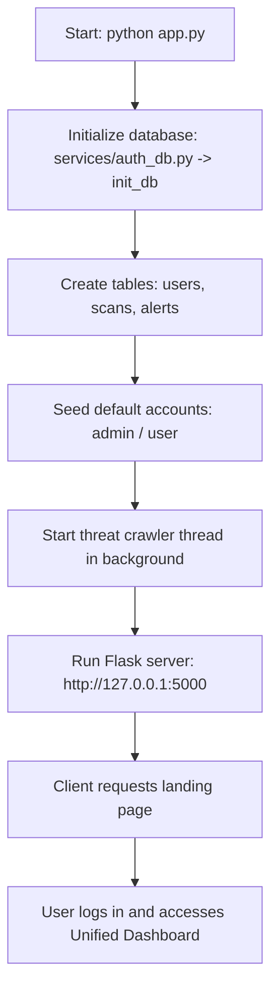
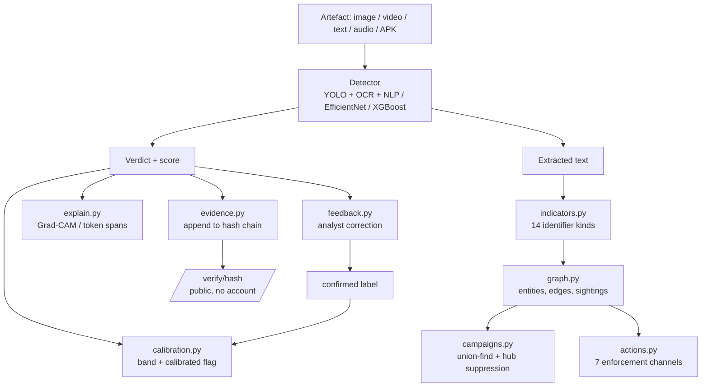
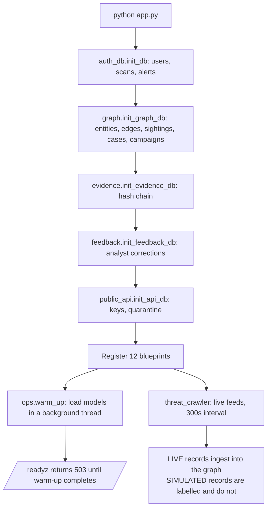

# Architecture Overview

`CYBERSURAKSHAA` is a unified AI-powered threat intelligence platform designed to detect, investigate, and analyze fraudulent digital content. It brings together four specialized detection suites into a single Flask-based web application with a responsive dashboard, database persistence, and background threat hunting.

---

## 🏗️ Technology Stack

| Component | Technology | Description |
| :--- | :--- | :--- |
| **Backend Core** | Python, Flask | Handles routing, blueprint registers, lazy loading of ML models, API endpoints, and session management. |
| **Database** | SQLite3 | Local SQL database that stores user credentials, scan history, and active threat feed alerts. |
| **Frontend** | HTML5, CSS3, JavaScript | Modern, glassmorphism-inspired user interface using Outfit & JetBrains Mono typography, custom sliders, dynamic overlays, and a dark/light mode toggle. |
| **Background Threading** | Python `threading` | Orchestrates a daemon crawler that continuously searches public feeds and fallbacks for active threat intelligence. |
| **Deep Learning & ML** | PyTorch, timm, XGBoost, XLM-RoBERTa | Powers deepfake classification, investment risk scoring, and semantic text analysis. |
| **Computer Vision** | OpenCV, YOLOv8, MTCNN | Used for face extraction in deepfakes and object/logo detection in social media betting screenshots. |
| **Text Processing** | PaddleOCR, spaCy NER | Performs optical character recognition and named entity extraction for customer care numbers. |

---

## 📂 Project Structure

Below is the file layout of the unified application:

```text
c:\Users\Danish\OneDrive\Desktop\All in one
├── app.py                      # Main entrypoint; initializes DB, starts background crawler, registers blueprints
├── cybersurakshaa.db           # SQLite database storing users, scans, and crawler alerts
├── requirements.txt            # Python dependencies (Flask, PyTorch, CV2, BS4, etc.)
│
├── blueprints/                 # Flask Controllers (Blueprints)
│   ├── auth.py                 # Handles login, registration, scans history api, and crawler alert blocking
│   ├── admin.py                # Admin console (user management, database diagnostics)
│   ├── betting.py              # Routing and integration for Betting Content Detector
│   ├── deepfake.py             # Routing and integration for Deepfake Face/Video Detector
│   ├── customer_care.py        # Routing and integration for Fake Customer Care Detector
│   └── investment.py           # Routing and integration for Investment Scam Detector
│
├── services/                   # Core Business Logic & Engines
│   ├── auth_db.py              # SQLite helper functions (user verification, scan/alert saving/deleting)
│   ├── threat_crawler.py       # Daemon crawler thread for scraping and simulating real-time feeds
│   ├── takedown_generator.py   # PDF & HTML compiler for legal Section 79 compliance notices
│   ├── report_generator.py     # PDF & HTML compiler for detailed CTI threat intelligence reports
│   └── scam_detector/          # Sub-engines for Investment Scam detector
│       ├── nlp_analyzer.py     # Dual-engine text analysis (XGBoost + XLM-RoBERTa)
│       ├── link_checker.py     # Extracted link extraction & domain age checks
│       └── fraud_scorer.py     # Combining NLP scores & domain risk into a final risk percentage
│
├── templates/                  # Jinja2 HTML Templates
│   ├── base.html               # Master layout containing head tags, sidebar navigation, drawer registry
│   ├── index.html              # Core dashboard containing real-time crawler ticker and module cards
│   ├── auth/                   # Registration and login forms
│   ├── admin/                  # User accounts management & dashboard diagnostics
│   ├── betting/                # Screenshot analysis UI for betting
│   ├── deepfake/               # Video and image analyzer UI for synthetic media
│   ├── customer_care/          # Customer care phone verification UI
│   └── investment/             # Text message analysis UI for financial scams
│
└── static/                     # Static assets
    ├── css/
    │   └── style.css           # Global custom styling (glassmorphism variables, dark mode styling)
    ├── js/
    │   └── main.js             # Core frontend controller (ajax uploads, ticker rendering, gauges drawing)
    └── uploads/                # Temporary file upload directory
```

---

## 🔄 Execution Workflow

The application executes through the following steps when starting up:



1. **Startup (`app.py`)**: Checks for the existence of `cybersurakshaa.db`. If empty, it initializes the schema and seeds default credentials: `admin` (password: `admin123`) and `user` (password: `user123`).
2. **Threat Crawler Service**: Launches a daemon thread that wakes up every 30 seconds to sweep public DuckDuckGo search results or use fallback alerts, feeding raw JSON threat records back into the SQLite `alerts` table.
3. **Lazy-Loading ML Models**: To keep server startup latency under 1 second, heavy libraries (`torch`, `timm`, `cv2`, `facenet_pytorch`, `paddleocr`) are imported and model weights loaded **only** when a user initiates a scan request for that specific module.
4. **Unified API & Scan History**: Each module returns detailed JSON results. If the scan is triggered inside a logged-in session, the user can save the analysis into a central registry (`scans` table). Users can then download PDF reports or generate legal takedown orders from the history drawer at any time.

---

## 🧠 The Intelligence Layer

The four detectors above are *classifiers*. The layer described here is what
turns a set of classifiers into a platform, and it is documented in full in
[`intelligence_layer.md`](intelligence_layer.md).

### The gap it closes

Each detector read an artefact, produced a verdict, wrote a row to `scans`, and
discarded everything else. The discarded part — the deposit UPI address, the
Telegram channel, the mule account, the APK signing certificate — is what
identifies the *operator*, and enforcement acts on operators, not on posters.
The system could report that thirty images were betting content but not that
one person made all thirty.

### Where it sits



The loop from `feedback` back into `calibration` is the important edge: it is
the only path by which the platform ever learns whether its verdicts were
right, and the only way `calibrated: false` stops being the honest answer.

### Design constraints worth knowing before editing

| Constraint | Why |
| :--- | :--- |
| `services/intel/` imports no Flask | Lets the test suite and offline analysis run without the ML stack; a failure in `torch` degrades one detector rather than the correlation layer |
| Entities are `UNIQUE(kind, value)`, upserted with `ON CONFLICT` | Two concurrent scans of the same poster must not race into two rows |
| Edges are undirected, ids ordered before writing | Two rows for `(A,B)` and `(B,A)` would double every co-occurrence weight |
| `MAX_INDICATORS_PER_ARTEFACT = 25` | An OCR dump of a spam wall is O(n²) edges and an unreadable graph |
| `HUB_DEGREE_LIMIT = 40` | A quoted helpline number would otherwise merge every unrelated operation into one cluster |
| Campaign clustering is a **full rebuild** | Union-find has no efficient un-merge; one wrong incremental merge would be permanent |
| Evidence appends take `BEGIN IMMEDIATE` | Two threads reading the same head would fork the chain |
| Public submissions are **quarantined** | Auto-ingesting attacker-controlled text would let one person forge arbitrary links the clustering would then report as findings |
| Feedback needs a **second** analyst | A correction confirming itself carries the evidential weight of one opinion, not two |

### Startup sequence, revised

`app.py` now initialises four schemas rather than one, and warms models in the
background instead of on first request:



Note the two corrections to the previous behaviour described above:

* The crawler interval is **300 seconds**, not 30 — and its simulated fallback
  records are now explicitly labelled and excluded from the entity graph. They
  were previously indistinguishable from real observations.
* Models are **warmed at startup** in a background thread rather than loaded on
  first request. `/readyz` reports 503 until they are ready, so a load balancer
  is told not to send traffic that would time out, and the first analyst of the
  day does not absorb a thirty-second model load.
