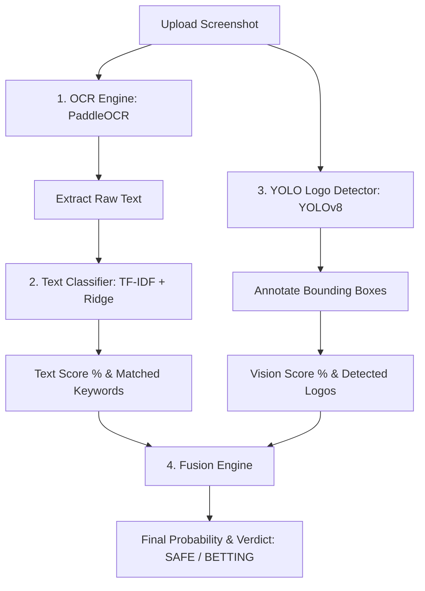

# Betting Content Detector Pipeline

The **Betting Content Detector** uses a multi-modal classification pipeline to analyze images (such as social media screenshots or ads) and identify gambling promotions. It fuses optical character recognition, NLP classification, and YOLO object detection to compute a unified risk score.

---

## ⚙️ Core Pipeline Diagram



---

## 🛠️ Step-by-Step Breakdown

### Step 1: Text Extraction (OCR)
* **Technology**: `PaddleOCR` (invoked via `OCRExtractor` class).
* **Process**:
  - The uploaded image bytes are passed directly to PaddleOCR.
  - Returns a list of detected words, coordinates, and OCR confidence levels.
  - The words are combined into a single raw text string (`ocr_text`).

### Step 2: NLP Text Classification
* **Technology**: Custom ML classifier (`models/text_classifier.py`).
* **Process**:
  - Preprocesses the extracted OCR text (lowercasing, cleaning).
  - Matches the text against a list of known betting/gambling keywords (e.g., *bet, jackpot, casino, play now, win, bonus, registration, deposit*).
  - Computes a text probability score using a pre-trained TF-IDF vectorizer + Ridge Classifier or a rule-based backup scoring mechanism.

### Step 3: Computer Vision Logo Detection
* **Technology**: `YOLOv8` (`ultralytics` package).
* **Process**:
  - Loads a custom-trained YOLO model checkpoint (`yolov8n.pt`).
  - Preprocesses the image bytes and runs object detection to look for known online gambling and betting company logos (e.g., *1xBet, Betway, Parimatch, Dafabet*).
  - Returns detected bounding boxes, label names, and confidence scores.
  - Saves an annotated image with colored bounding boxes surrounding any detected betting logos.

### Step 4: Fusion Engine
* **Technology**: Rule-based Decision Matrix (`fusion/engine.py`).
* **Process**:
  - Takes the **Text Probability** and **Vision Probability** (YOLO confidence) as inputs.
  - Fuses the scores using a weighted formula:
    $$\text{Final Score} = (\text{Text Probability} \times 0.6) + (\text{Vision Probability} \times 0.4)$$
  - Adjusts the score based on high-impact indicators (e.g., if a logo is detected with $>80\%$ confidence, the final classification is automatically elevated to `BETTING`).
  - Generates diagnostic reasons detailing what triggered the verdict.

---

## 📊 Sample Output Response

When an analyst scans an image, the backend returns a JSON payload:

```json
{
  "classification": "BETTING",
  "confidence": 92.5,
  "text_probability": 87.2,
  "vision_probability": 95.0,
  "ocr_text": "JOIN NOW! GET 200% DEPOSIT BONUS ON IPL BETTING...",
  "matched_keywords": ["deposit", "bonus", "betting"],
  "detected_logos": ["1xBet"],
  "reasons": [
    "High confidence logo detection: 1xBet (95%)",
    "Matched gambling keywords: deposit, bonus, betting"
  ],
  "annotated_image": "/9j/4AAQSkZJRgABAQ...", // Base64 representation of bounding box image
  "file_hash": "2f10b...",
  "recommendation": "RECOMMENDATION: Flagged betting content detected..."
}
```
The annotated image is displayed directly in the user interface, drawing green/red boxes around scam logos so analysts can immediately spot them.
