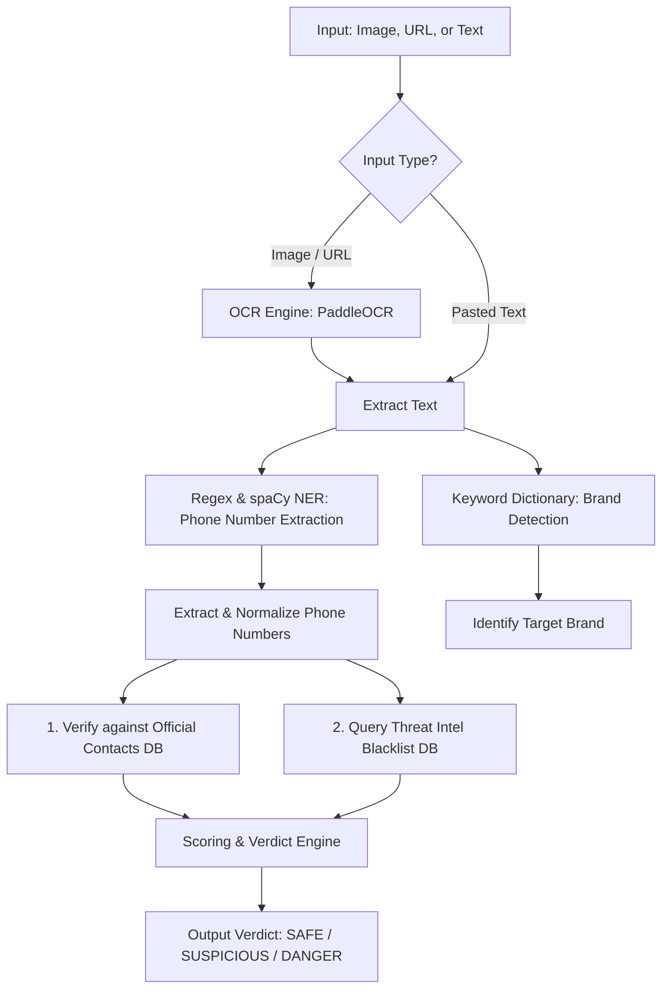

# Fake Customer Care Detector Pipeline

The **Fake Customer Care Detector** identifies spoofed helpdesk numbers in advertisements. It extracts text via OCR, parses phone numbers, extracts brand references, and verifies them against an official directory and a crowd-sourced threat intelligence database.

---

## ⚙️ Core Pipeline Diagram

---

## 🛠️ Step-by-Step Breakdown

### Step 1: Text Extraction (OCR / Raw Text)
- If the user uploads an image or URL, `PaddleOCR` extracts the textual components.
- Raw text can also be pasted directly.

### Step 2: Phone Number Extraction & Normalization
- Extracts raw phone numbers using regex patterns (matching typical Indian formats like `+91`, `0`, or 10-digit formats).
- Normalizes them by stripping spaces, hyphens, and the country code to yield a standardized 10-digit integer string (e.g., `+91 81247-96305` becomes `8124796305`).

### Step 3: Brand Identification
- Analyzes text for keywords representing major banking, telecom, or retail brands (e.g., *SBI, GPay, Paytm, Amazon, Flipkart, Netflix*).
- Brand matching returns the brand name and a confidence score.

### Step 4: Verification Checks
The normalized primary phone number is evaluated against two SQLite lookup tables:
1. **Official Directory (`official_contacts` table)**: Maps brands to their verified toll-free or customer care lines.
   - If the extracted number matches the official record, it is considered **Verified Safe**.
2. **Threat Intelligence Blacklist (`indicators` table)**: Tracks user-reported scam numbers and cumulative reports.
   - If the number exists here, it is treated as a verified threat.

### Step 5: Heuristic Risk Scoring
Risk scores are calculated dynamically based on specific criteria:
- **Danger (Score: 85 - 99)**:
  - Phone number is present, but doesn't match the official brand contact.
  - Number is flagged in the threat blacklist.
- **Suspicious (Score: 40 - 84)**:
  - Phone number is not in the blacklist, but is unverified (doesn't match the brand's official numbers).
- **Safe (Score: 0)**:
  - The extracted number matches the brand's verified contact, OR no phone numbers are found in the text.

---

## 📊 Scam Heuristic Indicators

The interface displays five key risk metrics computed in the backend:

1. **Urgency Index**: Measures time-pressure terms (*immediately*, *urgent*, *blocked*, *suspended*).
2. **Coercion Rating**: Measures authority-impersonation terms (*officer*, *rbi*, *kyc*, *penalty*, *jail*).
3. **CTA Density**: Counts the frequency of phone numbers, links, and action verbs (*call now*, *visit*).
4. **Telecom Trust**: Calculates a carrier confidence score:
   - **95% (Verified Enterprise Line)** if officially verified.
   - **12% (Flagged VoIP)** if blacklisted.
   - **40% (Unverified VoIP)** if unknown.
5. **Linguistic Anomalies**: Detects spacing patterns (e.g., `H E L P`) or repetitive symbols used to bypass automated spam filters.
