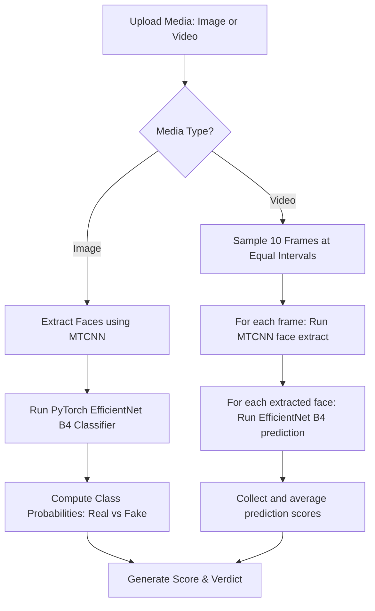

# Deepfake Face & Video Detector Pipeline

The **Deepfake Detector** is a deep learning system designed to identify AI-generated synthetic manipulations (such as facial swaps, diffusion modifications, or GAN faces) in static images and digital videos.

---

## ⚙️ Model Architecture & Flow



---

## 🛠️ Step-by-Step Breakdown

### Step 1: Loading ML Framework (Lazy Loading)
* **Technology**: `facenet_pytorch.MTCNN`, `timm` (Torch Image Models), `torchvision`.
* **Process**:
  - The model components are imported and initialized during the first scan request.
  - The detector checks for CUDA availability. If a GPU is present, it assigns operations to the GPU (`cuda`) for fast video frame extraction; otherwise, it defaults to the CPU.
  - EfficientNet B4 structure is loaded (`num_classes=2`) and mapped to the pre-trained weights file `best_model.pth`.

### Step 2: Face Extraction (MTCNN)
* **Technology**: Multi-task Cascaded Convolutional Networks (`MTCNN`).
* **Process**:
  - Raw images are preprocessed. MTCNN detects bounding boxes around faces.
  - Out of all detected faces, the primary face is extracted, resized to $224 \times 224$ pixels, and padded with a 20px margin.
  - If no face is detected in the image (or in any sampled video frames), the pipeline exits early returning a `No face detected` warning.

### Step 3: EfficientNet B4 Classification
* **Technology**: PyTorch neural network.
* **Process**:
  - The normalized face tensor is processed through transforms:
    - Normalization with ImageNet statistics: $\mu = [0.485, 0.456, 0.406]$, $\sigma = [0.229, 0.224, 0.225]$.
  - The tensor is evaluated through the classification head of EfficientNet B4.
  - Outputs are normalized using Softmax:
    $$\text{Probabilities} = \text{Softmax}(\text{Logits})$$
  - The probability of class `1` (which represents the fake/manipulated class) is taken as the threat score.

### Step 4: Video Sampling Loop
* **Technology**: OpenCV (`cv2.VideoCapture`).
* **Process**:
  - When a video file is uploaded, OpenCV extracts the total frame count.
  - The detector calculates a sampling interval to select **10 frames** spaced evenly across the duration of the video.
  - For each sampled frame, the MTCNN and EfficientNet pipeline is run.
  - The scores from all valid frames are averaged.
  - Verdict threshold is set at $50\%$:
    - $\text{Average Score} > 0.50 \implies \text{FAKE}$
    - $\text{Average Score} \le 0.50 \implies \text{REAL}$

---

## 📊 Sample Output Response

```json
{
  "verdict": "FAKE",
  "score": 97.4,
  "frames": 10,
  "file_hash": "a5d89...",
  "recommendation": "RECOMMENDATION: Critical Alert: Highly probable AI-generated synthetic manipulation (Deepfake) detected..."
}
```
An representative frame is captured from the video and saved permanently under [static/uploads](file:///c:/Users/Danish/OneDrive/Desktop/All%20in%20one/static/uploads) to generate PDF/HTML threat intelligence reports.
