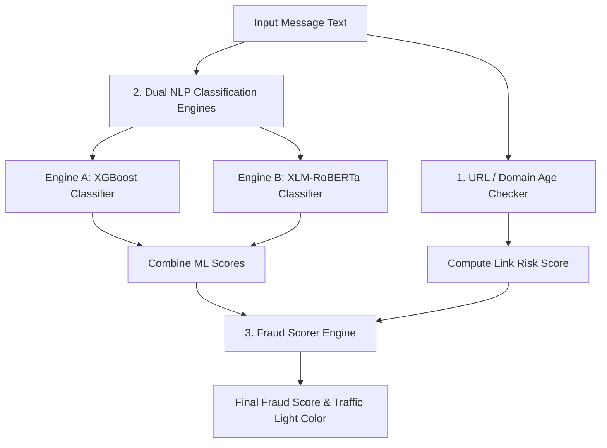

# Investment Scam Detector Pipeline

The **Investment Scam Detector** uses a dual-engine machine learning pipeline coupled with live domain reputation checks to analyze text advertisements and identify fraudulent financial schemes, crypto traps, and Ponzi schemes.

---

## ⚙️ Core Pipeline Diagram



---

## 🛠️ Step-by-Step Breakdown

### Step 1: Link & Domain Age Checker
* **Technology**: `urllib`, custom WHOIS domain query lookup (`services/scam_detector/link_checker.py`).
* **Process**:
  - Extracts all URLs embedded in the message using regex.
  - Queries domain details. If the domain was registered within the last **365 days**, it is classified as a high-risk indicator.
  - Calculates a **Link Risk Score** (up to $99$ if newly registered, suspicious, or IP-based hosting).

### Step 2: Dual NLP Classification Engines
* **Technology**: XGBoost Classifier, XLM-RoBERTa deep learning model (`services/scam_detector/nlp_analyzer.py`).
* **Process**:
  - **Engine A (XGBoost + TF-IDF)**:
    - Preprocesses the text (tokenization, cleaning).
    - Checks for high-risk financial phrases (e.g., *guaranteed return, double your money, invest now, daily ROI, risk-free*).
    - Runs text through an XGBoost model. If the model files are missing, it falls back to a robust keyword scoring matrix.
  - **Engine B (XLM-RoBERTa)**:
    - A multilingual deep learning transformer that evaluates semantic meaning, catching scams translated into different languages.
    - If PyTorch/transformer models are offline, Engine B gracefully reports as offline and relies on Engine A's fallback scoring.
  - The higher of the two scores is selected as the **Effective NLP Score**.

### Step 3: Fraud Scorer (Weight Integration)
* **Technology**: Multi-factor integration model (`services/scam_detector/fraud_scorer.py`).
* **Process**:
  - Combines the Effective NLP Score and the Link Risk Score.
  - If a high-risk link is present, it increases the overall score.
  - Returns a final risk score (0 to 100) and maps it to a **Traffic Light Verdict**:
    - 🔴 **Red (High Risk, $>70$)**: Clear fraud signals.
    - 🟡 **Yellow (Warning, $30 - 70$)**: Suspicious content, proceed with caution.
    - 🟢 **Green (Safe, $<30$)**: Standard communication.

---

## 📊 Sample Output Response

```json
{
  "traffic_light": "red",
  "final_fraud_score": 97,
  "engine_breakdown": {
    "engine_a_xgboost": 95,
    "engine_b_xlm_roberta": 0 // Offline or fallback mode
  },
  "engine_status": {
    "engine_a_online": false, // Running on keyword fallback
    "engine_b_online": false
  },
  "reasons": [
    "🚩 High-risk financial scam keyword detected: 'double money'",
    "🚩 Urgency indicator found: 'in 24 hours'",
    "🔗 Newly registered or suspicious short-term link: 'http://cryptoloot-double-india.org'"
  ],
  "file_hash": "e3b0c...",
  "recommendation": "RECOMMENDATION: High investment fraud threat level detected. The message leverages psychological pressure..."
}
```
The user interface renders this as a colorful speed gauge with a verdict banner, breaking down the outputs of both Engine A and Engine B.
