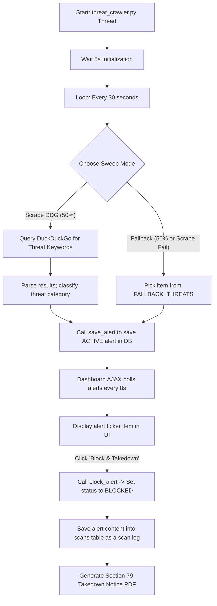

# Threat Crawler & Legal Takedown Notice Flow

This document details how `CYBERSURAKSHAA` crawls external networks for threat intelligence, feeds the real-time ticker on the homepage, and generates legal compliance takedown orders.

---

## ⚙️ Threat Crawler & Takedown Loop

---

## 🛠️ Step-by-Step Breakdown

### 1. Threat Intelligence Crawler (`services/threat_crawler.py`)
- Launches as a background Python thread during app startup.
- Every 30 seconds, it performs one of two operations:
  1. **Live Search Scraping**: Queries DuckDuckGo for scam keywords (e.g., *“official paytm helpline support number”*, *“ipl free betting app download link”*). It parses the top 3 results, classifies their content, and calculates a risk score.
  2. **Fallback Feed**: Picks a threat from a pool of 8 high-fidelity templates to ensure a continuous stream of realistic data.
- **De-duplication & Re-activation**:
  - The crawler checks for duplicates in the `alerts` database using the URL.
  - If a matching alert exists, it is deleted and re-inserted. This updates its ID and timestamp, bringing it to the top of the feed and reactivating it if it was previously blocked.

### 2. Live Dashboard Polling
- On the homepage, JavaScript runs `initLiveThreatFeed()`, which polls `/auth/api/alerts` every 8 seconds.
- If the fetched alert IDs or their order change, the ticker refreshes and renders the new list.

### 3. Takedown Logic (`POST /auth/api/alerts/<id>/block`)
When an analyst clicks **Block & Takedown**:
1. The alert's status in the database is updated to `BLOCKED`, removing it from the active ticker feed.
2. The alert is saved to the user's `scans` history table so it can be audited.
3. The server immediately returns a `scan_id` and triggers a redirect to open the **Section 79 Takedown PDF** in a new tab.

---

## 📄 Compliance Document Compilation

### 1. IT Act Section 79 Takedown Notice (`services/takedown_generator.py`)
Generates a formal legal document served to intermediaries (such as ISPs, web hosting companies, or social media platforms).
* **Statutory Basis**: Section 79(3)(b) of the Indian Information Technology Act, 2000.
* **Requirements**: Notifies the intermediary of illegal content hosting on their network. Upon receipt, they must disable access within 36 hours to maintain their safe-harbor immunity.
* **Output Format**:
  - A PDF generated dynamically using `reportlab`. It features the official National Cyber Security Command Centre logo, official legal phrasing, specific details of the scanned threat, and a signature line.
  - An HTML template alternative is also available.

### 2. CTI Report Export (`services/report_generator.py`)
Generates comprehensive Cyber Threat Intelligence (CTI) reports for the security archive.
* **Components**: Includes the scan timestamp, module details, risk gauges, confidence ratings, matching keywords, and an embedded image of the original screenshot (for Betting/Deepfake scans).
* **Mechanism**: Compiles the report metadata, retrieves the stored image by its SHA256 file hash, and builds the document using `reportlab`.

