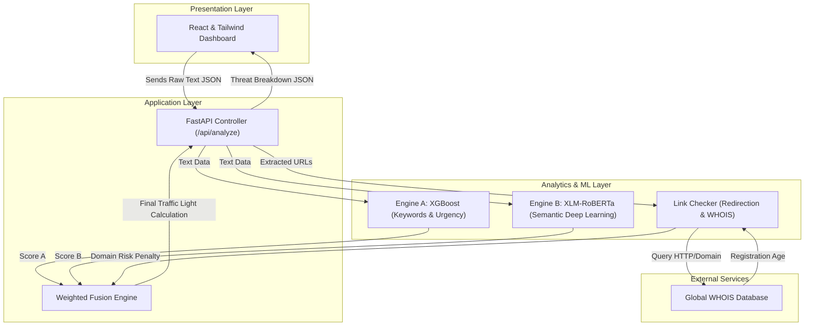
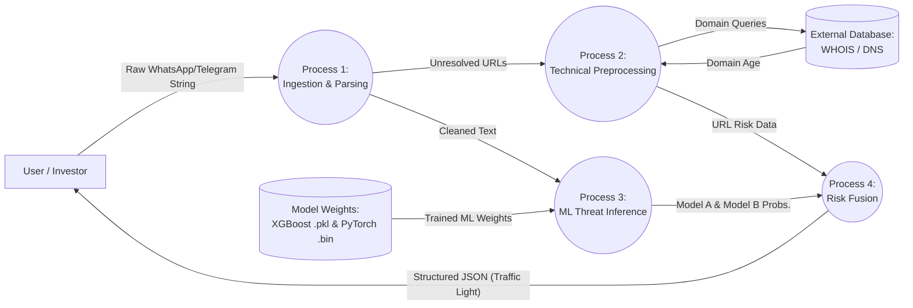
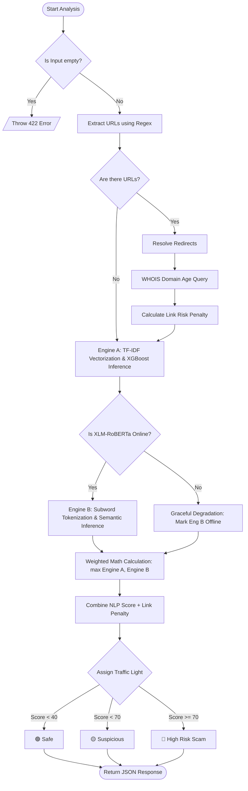

# Chapter 4: Design and Implementation

## 4.1 Introduction

This chapter discusses the detailed design and system architecture of ScamGuard AI. The primary goal of the design phase is to translate the conceptual ideas and mathematical algorithms formulated in previous chapters into a structured blueprint that can be implemented as a fully functional software system.

A well-designed architecture ensures high performance, maintainability, and scalability. To illustrate the flow of data, process logic, and structural components of the system, this chapter incorporates three distinct visualizations: a Block Diagram mapping the architecture, a Data Flow Diagram (DFD) showing the lifecycle of user inputs, and a logical Flowchart representing the algorithmic decision-making tree within our Fast API backend.

---

## 4.2 System Block Diagram

The Block Diagram illustrates the high-level components of the ScamGuard AI architecture and how they structurally communicate. It is divided into the Presentation Layer (Frontend), the Application Layer (Backend API), and the Analytics Layer (ML Models and External Validation APIs).

---

## 4.3 Data Flow Diagram (DFD)

The Data Flow Diagram models the specific flow of information exactly as it is processed by the ScamGuard AI backend. It highlights the transition from an unstructured string into mathematical feature vectors and finally into a risk categorization.

---

## 4.4 Algorithmic Flowchart

The Process Flowchart demonstrates the internal decision-making logic of the `Analyze` endpoint. It illustrates the exact steps the system takes, including graceful degradation (fallback logic) in case the deep learning models or the WHOIS database fail to respond.

---

## 4.5 Implementation Specifications

### 4.5.1 Frontend Implementation
The dashboard is built entirely with **React** mapped via **Vite** for rapid hot-module reloading. It utilizes **Tailwind CSS** for a deep, modern, dark-mode aesthetic. The system interacts with the backend asynchronously using Fetch APIs, capturing `engine_status` booleans to immediately warn users if the backend has entered "Graceful Degradation" mode.

### 4.5.2 Backend Implementation
The API layer is hosted on **FastAPI** utilizing Uvicorn standard. This framework was chosen primarily for its asynchronous capabilities and native Pydantic validation, which ensures raw text injections conform to predefined schemas before ever touching the ML models.

### 4.5.3 Machine Learning Deployment
- **Engine A (XGBoost):** Loaded into application memory via the `pickle` library upon server boot. It runs completely sequentially via CPU processing. 
- **Engine B (XLM-RoBERTa):** Loaded utilizing the `transformers` payload from Hugging Face. To prevent runtime blocking, the tensors are dynamically moved to the GPU parameter using PyTorch (`.to(device)`) if an NVIDIA CUDA environment is active in the deployed container.

## 4.6 Summary

This chapter detailed the structural planning necessary to translate the theoretical ScamGuard AI algorithms into production software. Through the Block Diagram, DFD, and Flowchart, we visually mapped the integration of technical HTTP tracking with advanced semantic modeling. The resulting architecture remains highly robust, capable of maintaining security validations even when external APIs momentarily fail.
